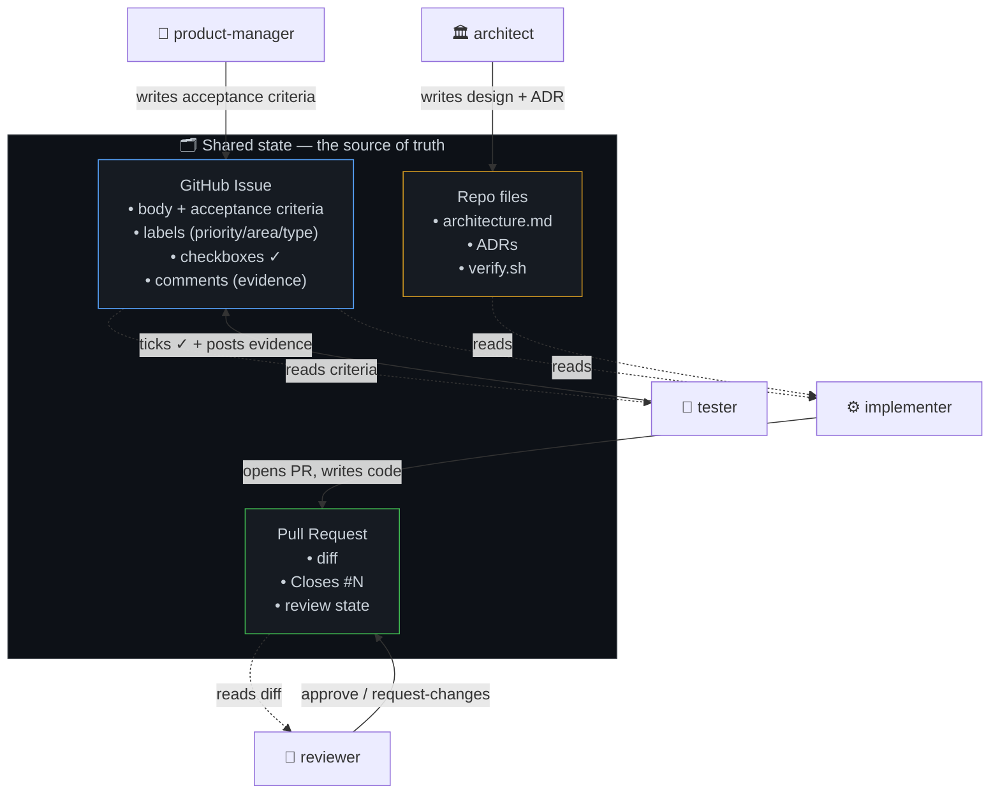
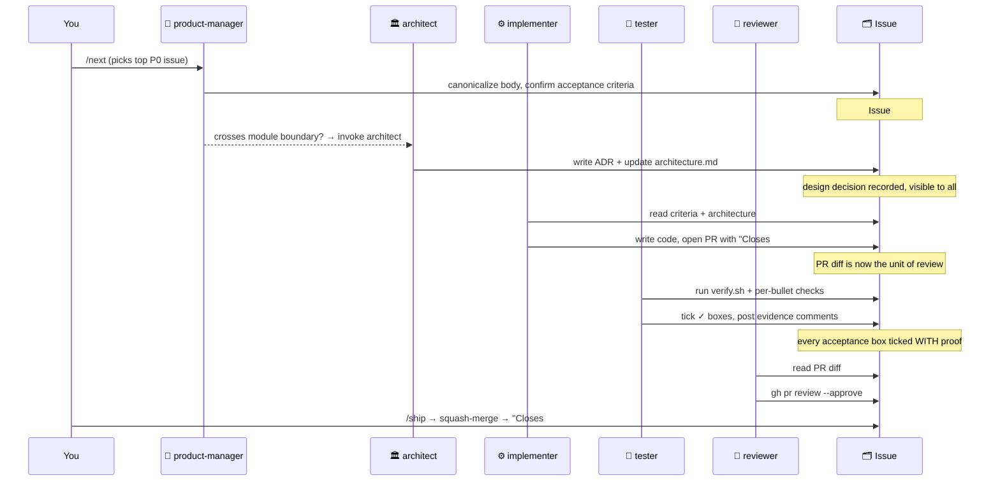
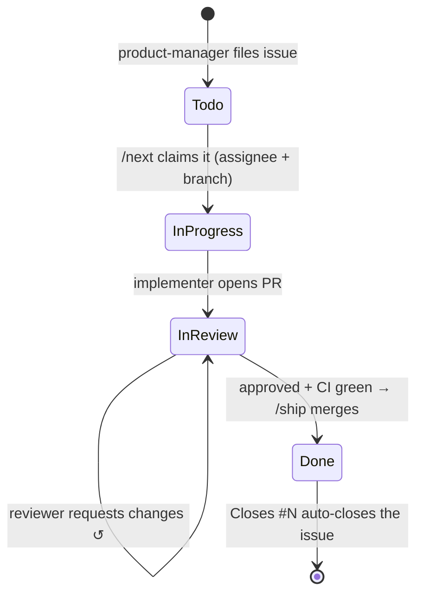
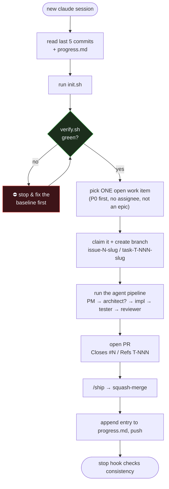
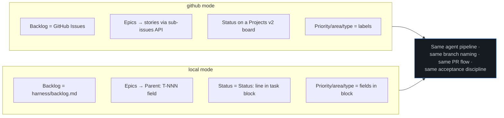
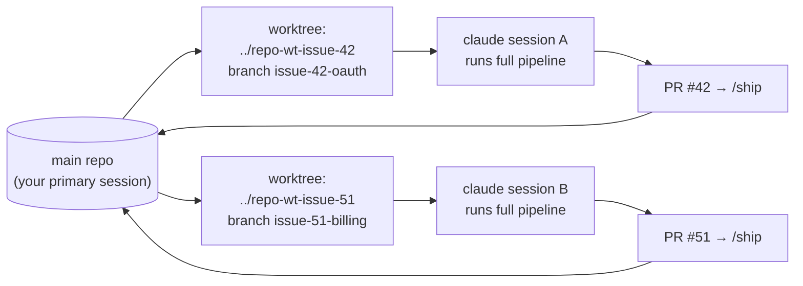

# engineering-workflow

> A boilerplate for building **any product** with a small team of specialized Claude Code agents — where the agents coordinate the way a real engineering team does: through **issues, pull requests, and review**, not chat.

Pick **GitHub-tracked** or **local-only** state per project — the same agent pipeline runs either way.

This repo ships a pre-wired **harness**: agent roles, slash commands, shared skills, hooks, scripts, and optional GitHub provisioning — so that long-running agent work survives context resets and many parallel sessions. The design follows Anthropic's [Effective harnesses for long-running agents](https://www.anthropic.com/engineering/effective-harnesses-for-long-running-agents).

---

## The big idea in one picture

A single Claude session is forgetful — it loses context, it can't run for days, and you can't easily parallelize it. This harness fixes that by refusing to keep state *in the conversation*. Instead, **all state lives in durable artifacts** (GitHub Issues, PRs, files), and agents read and write those artifacts to coordinate.



**No agent sends a message to another agent.** The product-manager doesn't "tell" the implementer what to build — it writes acceptance criteria into the issue, and the implementer reads them. The tester doesn't "tell" the reviewer the work is done — it ticks the checkboxes and posts evidence, and the reviewer sees a green issue. This is **stigmergy**: coordination through the shared environment, the same way a team coordinates through a ticket board. It's what makes the work resumable, auditable, and parallelizable.

---

## The cast: six specialized agents

Each agent has a narrow job and a strict set of artifacts it's allowed to touch. One agent never does another's job — that boundary is what keeps the audit trail trustworthy.

| Agent | Role | Reads | Writes (owns) |
|---|---|---|---|
| 🧭 **product-manager** | Turns the spec into atomic, testable issues | `docs/spec.md` | Issue body, `### Acceptance criteria`, `priority:*` labels |
| 🏛️ **architect** | Makes cross-cutting decisions *(only when a task crosses module boundaries)* | spec, epics | `docs/architecture.md`, ADRs |
| ⚙️ **implementer** | Writes the code for exactly one issue | issue body, architecture | application code, the PR, `Closes #N` |
| 🔬 **tester** | Proves each acceptance bullet with evidence | acceptance criteria | the checkboxes ✓, evidence comments |
| 👀 **reviewer** | Approves or blocks the PR on real issues only | the PR diff | PR review state |
| 🛠️ **devops** | Owns the dev environment *(at kickoff, or when a task adds infra)* | the stack | `init.sh`, `verify.sh`, `ci.yml` |

The full ownership matrix — who may flip which label, tick which box, close which issue — lives in [`.claude/skills/system-role-boundaries`](.claude/skills/system-role-boundaries/SKILL.md). The hooks enforce the hard ones (e.g. only the product-manager may apply a `priority:*` label).

---

## The operating model: how one issue gets built

Every work item flows through the same pipeline. Crucially, **each stage hands off by changing a durable artifact**, not by passing a message. Here's issue #42 ("add OAuth login") moving through the line:



The rule that makes this trustworthy: **evidence over assertion**. A box only gets ticked when the tester can show a passing `curl`, a CLI exit code, a DB row, or a browser screenshot. A PR only merges when `verify.sh` is green **and** every acceptance box is ticked **and** the reviewer approved. No agent is allowed to edit the acceptance criteria to make a check pass — that's the one thing the harness exists to prevent.

---

## The state machine: where work lives

Each issue moves through a small set of states. In `github` mode these are a Projects v2 board column + labels; in `local` mode they're a `Status:` line in `harness/backlog.md`. Same states, different surface.



The status field is what lets a brand-new session — with zero conversation history — answer "what's in flight, what's blocked, what's next?" just by reading GitHub. That's the whole point: **the board is the memory.**

---

## The session loop

Every coding session runs the same protocol, enforced by `CLAUDE.md` and the session-start hook:



Two guardrails worth calling out:

- **One work item per session.** Even if there's time for more. Long multi-issue sessions create merge pain and bad handoffs.
- **The stop hook** blocks you from ending a session with a red `verify.sh` on an issue branch, or uncommitted changes with no open PR. Soft warnings (e.g. no progress entry) print but don't block.

---

## Two tracking modes, one pipeline

The pipeline above never changes. What changes is **where the work items live** — chosen per project at the first session via `/init-mode`.



| | **`github` mode** (default) | **`local` mode** |
|---|---|---|
| Source of truth | GitHub Issues + Projects v2 | `harness/backlog.md` |
| Best for | Teams, visible boards, PR discipline on github.com | Personal/sensitive projects, no Issues surface |
| Needs `gh` | Yes | Only for PRs (optional) |
| Work-item id | issue `#N` | task `T-NNN` |

> **Mode is a deployment choice, not a discipline choice.** Both modes enforce the same acceptance-criteria gate, evidence rules, and role boundaries. Switch anytime with `/init-mode <github|local>` — it offers a one-shot migration in either direction.

---

## Quick start

```bash
git clone https://github.com/cvsubs74/engineering-workflow my-product
cd my-product
claude
> /init-mode github          # or local
> /start                     # or /kickoff if you already wrote docs/spec.md
```

`/start` (github mode) runs a full wizard:

1. Preflights `gh` (version + auth scopes); hints at install/refresh if missing.
2. Detaches your directory from the boilerplate's git history (`rm -rf .git && git init -b main`).
3. Asks ~8 conversational questions and drafts `docs/spec.md` (you review + edit before saving).
4. **Creates a GitHub repo** (private by default), personalizes `CODEOWNERS`, pushes the first commit.
5. Runs `scripts/gh-bootstrap.sh` — syncs labels, creates the `v0.1` milestone, provisions a Projects v2 board (Status / Estimate / Worktree fields).
6. Hands off to `/kickoff` — dispatches **product-manager** (files epics + stories with sub-issue links), **architect** (drafts `architecture.md`, files ADR-0001 as a closed spike issue), **devops** (fills `init.sh` / `verify.sh` / CI). Watches the first CI run and enables branch protection on `main` requiring the `verify` check.
7. Prints a next-steps banner with the board URL, issue counts, and the `/status`, `/next`, `/parallel` commands.

`/start` (local mode) skips repo creation + provisioning; `/kickoff` seeds `harness/backlog.md` with `T-NNN` task blocks instead.

After kickoff, every subsequent session is just:

```
> /next                    # pick the top P0 item, branch, run pipeline, open PR
> /parallel 42             # github mode — build issue #42 in an isolated worktree
> /parallel task T-007     # local mode  — build task T-007 in an isolated worktree
```

### What you'll see on GitHub after `/start` + `/kickoff`

- A new private (or public) repo with labels synced from `.github/labels.json` (`type:*`, `priority:*`, `area:*`, `meta:*`) and a `v0.1` milestone.
- A Projects v2 board with custom fields Status / Estimate / Worktree.
- 3–6 epic issues + 15–30 story issues, organized as sub-issues under their parent epic, all at Status=Todo.
- 4 closed `meta:bootstrap` issues forming the audit trail for what kickoff did (init.sh, verify.sh, CI, ADR-0001).
- `main` protected: the `verify` CI check must pass before any PR merges. Squash-merge with auto-delete-branch is the default.

---

## Parallel work

Independent work items build concurrently in git worktrees — separate working directories so two Claude sessions never step on each other.



```
> /parallel 42             # github mode — issue #42
> /parallel task T-007     # local mode  — task T-007
```

- **github mode**: validates issue #42 is open + unassigned + not an epic, creates `../<repo>-wt-issue-42` on branch `issue-42-<slug>`, posts a comment on the issue announcing the worktree path.
- **local mode**: validates task T-007 is `Status: open` + not `Type: epic`, creates `../<repo>-wt-task-T-007`, updates the task's `- Worktree:` line in `backlog.md`.

Open a second `claude` session inside the worktree. When done, run `/ship` from the worktree — it pushes the branch, opens the PR if missing, and once CI is green + review approved, squash-merges into `main` and tears down the worktree. Always go through `/parallel` and `/ship`, never hand-roll `git worktree add` — see [`worktree-management`](.claude/skills/worktree-management/SKILL.md).

---

## Commands

| Command | When to use |
|---|---|
| `/init-mode <github\|local>` | Set or change the tracking mode. Run once at the start of a project. |
| `/start` | First session after cloning — wizard that drafts the spec, provisions GitHub (github mode), runs `/kickoff`. |
| `/kickoff` | Power-user alternative — you wrote `docs/spec.md` by hand; seeds the backlog, drafts architecture, fills init/verify. |
| `/next` | Every subsequent session — builds the next top-priority item end to end. |
| `/parallel <id>` | Spin off concurrent work in a worktree (issue # or `T-NNN`). |
| `/status` | Backlog counts + open PRs + board URL (github mode). |
| `/verify` | Read-only sanity check of the dev environment. |
| `/retro <id>` | Post-task reflection appended to `progress.md` (and the closed issue in github mode). |
| `/ship` | Squash-merge the PR, close the work item, tear down the worktree. |

---

## Prerequisites

- **`gh` CLI ≥ 2.49** (github mode only) — the sub-issues REST API is GA from January 2025. `brew install gh` or your platform equivalent. Not needed for local mode except for PR operations.
- **`gh auth login`** (github mode) with scopes `repo`, `read:org`, `project`. Missing `project`? Run `gh auth refresh -s project,read:org` (interactive — run it in a TTY, not via `!` in Claude Code).
- **`jq`** — used by label sync, project lookups, and the session-start banner.
- **`git`** (both modes) — worktrees + branch/PR mechanics.

---

## Layout

```
.
├── CLAUDE.md                       Harness contract every session reads (mode-aware)
├── .claude/
│   ├── settings.json               Permissions, hooks, env
│   ├── harness-mode.json           Written by /init-mode; chooses github | local
│   ├── commands/                   /start, /init-mode, /kickoff, /next, /parallel,
│   │                               /ship, /status, /retro, /verify
│   ├── agents/                     product-manager, architect, implementer, tester, reviewer, devops
│   ├── skills/                     Shared cross-agent rules (≤ 200 lines each):
│   │                               system-role-boundaries, worktree-management,
│   │                               label-discipline, file-bug, skill-maintenance
│   └── hooks/                      session-start.sh (mode-aware banner), stop.sh (consistency gate)
├── harness/
│   ├── init.sh                     Bring up dev env (filled at /kickoff by devops)
│   ├── verify.sh                   End-to-end smoke test (filled at /kickoff)
│   ├── progress.md                 Personal append-only session log (informational)
│   ├── backlog.md                  Local-mode source of truth (T-NNN blocks); template in github mode
│   └── decisions/                  ADRs — each significant one is also a closed type:spike issue (github)
├── docs/
│   ├── spec.md                     YOU fill this in (via /start, or by hand)
│   ├── architecture.md             Maintained by architect agent
│   └── runbook.md                  Ops notes
├── scripts/
│   ├── gh-bootstrap.sh             github: sync labels, milestone, Projects v2 board
│   ├── gh-sub-issue.sh             github: link child issue under parent epic
│   ├── gh-project.sh               github: add-item / set-status / set-field on the board
│   ├── gh-next-issue.sh            github: print next P0→P1→P2 open unassigned issue
│   ├── new-worktree.sh             both modes — <issue-#> (github) or task <T-NNN> (local)
│   └── merge-worktree.sh           both modes — handles issue-* and task-T-NNN-* branches
└── .github/
    ├── ISSUE_TEMPLATE/             epic.yml, story.yml, bug.yml, spike.yml, config.yml
    ├── PULL_REQUEST_TEMPLATE.md    Closes #, evidence, checklist
    ├── CODEOWNERS                  Wildcard ownership; expandable for teams
    ├── labels.json                 Declarative label set, synced by gh-bootstrap.sh
    └── workflows/ci.yml            Runs verify.sh — job name `verify` is load-bearing for branch protection
```

---

## Philosophy

- **Agents coordinate through artifacts, not chat.** The issue, the PR, and the diff are the messages. This is what makes work resumable across context resets and parallelizable across sessions.
- **The board is the memory.** A fresh session reconstructs everything it needs from GitHub (or `backlog.md`) — never from conversation history.
- **Evidence over assertion.** A PR merges only after `verify.sh` is green **and** every acceptance box is ticked with proof **and** the reviewer approved.
- **Roles are boundaries.** No agent edits acceptance criteria, ticks its own boxes, or removes a test to go green. The harness exists to prevent exactly that.
- **One work item per session.** Forces clean handoffs.
- **Mode is a deployment choice, not a discipline choice.** github and local enforce identical discipline.

---

## License

MIT — see [LICENSE](./LICENSE).
```